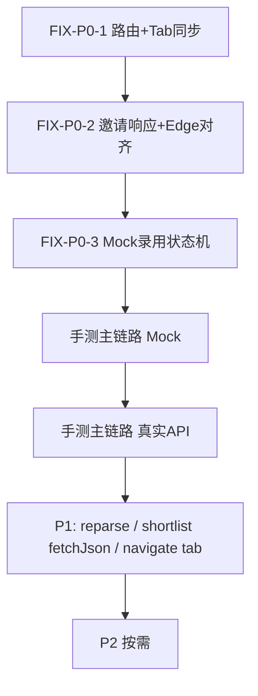

# EM-BOX 前端功能审查 — 详细修复建议

> 配套主报告：[`docs/FRONTEND_FEATURE_REVIEW.md`](./FRONTEND_FEATURE_REVIEW.md)  
> 审查日期：2026-07-14 | 本文侧重：**怎么改、改哪里、验收标准**  
> 约定：先修 P0（主链路可演示），再修 P1（开发体验/一致性），P2 可排期

---

## 一、已有交付物一览

| 交付物 | 路径 | 内容 |
|--------|------|------|
| 功能审查主报告 | [`docs/FRONTEND_FEATURE_REVIEW.md`](./FRONTEND_FEATURE_REVIEW.md) | Phase 0 模块导读、覆盖矩阵、Click-Path、Top 10、风险清单 |
| 可视化总览 Canvas | Cursor canvases：`frontend-feature-review.canvas.tsx` | 模块完成度、P0 链路健康度、Top 风险 |
| 本文件（详细修复） | [`docs/FRONTEND_FEATURE_REVIEW_FIXES.md`](./FRONTEND_FEATURE_REVIEW_FIXES.md) | 逐项根因、推荐改法、代码级建议、验收 |

覆盖统计（核心 🔴/🟡，n=136）：**Covered 78 / Partial 31 / Missing 9 / Deviated 6 / Outdated 12**。

---

## 二、修复原则（动手前必读）

1. **候选人公开入口**与**内部面试体验**是两条 URL：
   - 候选人：`/interview/:token`（公开，无 JWT）
   - 内部预览/场次进入：`/interviews?tab=preview&templateId=&sessionId=&candidateId=...`（需登录）
2. Express 的 `POST /api/shortlist/:id/interview-invite` **会**创建 session，并返回 `interviewSession: { sessionId, accessToken, interviewUrl }`。
3. Edge `embox-api/shortlist` 的同路径 handler **目前不会**创建 session（只写 outreach + next_step）。完整逻辑在 **`/cross-table-ops/shortlist-interview-invite`**。
4. 前端 shortlist 在 `USE_MOCK_API=false` 时走 **efetch → Edge shortlist**，因此生产路径更容易「邀请成功但无 session」。

---

## 三、P0 修复（建议同一 PR / 同一天做完）

### FIX-P0-1：场次管理「开始面试」路由写错

| 项 | 内容 |
|----|------|
| 严重度 | P0 — 内部无法从管理页进入可评分面试 |
| 位置 | `src/modules/interviews/pages/InterviewManagementPage.tsx` ≈134–151 |
| 现状 | `pushState('/interviews/preview?...')`，`AppRouter` **无**该 Route |
| 正确入口 | `/interviews?tab=preview&templateId&sessionId&candidateId&candidateName&candidateEmail`（由 `InterviewCenterPage` 的 `tab=preview` 渲染 `InterviewPreviewPage` → `AIVideoInterviewPage`） |

#### 根因

`InterviewCenterPage` 用 `?tab=` 切 Tab；`AIVideoInterviewPage` 从 **当前 URL searchParams** 读 `templateId` / `sessionId` 等。路径写成 `/interviews/preview` 会离开已注册路由。

#### 推荐改法（优先 A）

**A. 用 React Router 导航 + 保留 query（推荐）**

```tsx
// InterviewManagementPage.tsx — handleEnterInterview
import { useNavigate } from 'react-router-dom';

const navigate = useNavigate();

const handleEnterInterview = async (session: InterviewManagementSession) => {
  try {
    await updateSessionStatus(session.id, 'in_progress');
  } catch (e) {
    console.warn('Failed to update session to in_progress:', e);
  }

  const params = new URLSearchParams({
    tab: 'preview',
    templateId: session.templateId ?? '',
    sessionId: session.id,
    candidateId: session.candidateId ?? '',
    candidateName: session.candidateName ?? '',
    candidateEmail: session.candidateEmail ?? '',
  });
  navigate(`/interviews?${params.toString()}`);
};
```

**B. 若坚持独立 URL**：在 `AppRouter.tsx` 增加  
`<Route path="/interviews/preview" element={<InterviewPreviewPage />} />`  
并保证该页同样读取 query。仍建议统一为 A，避免两套入口。

#### 连带修复：`InterviewCenterPage` 同步 URL → Tab

当前 `activeTab` 只在 **mount** 时读一次 `tabFromUrl`，同页内 `navigate` 改 query 可能不切换 Tab。

```tsx
// InterviewCenterPage.tsx — 增加
useEffect(() => {
  if (tabFromUrl && TABS.some(t => t.id === tabFromUrl)) {
    setActiveTab(tabFromUrl);
  }
}, [tabFromUrl]);
```

`handleTabChange` 切 Tab 时应用 `setSearchParams` **合并**已有业务参数，避免清掉 `sessionId`：

```tsx
const handleTabChange = (tab: TabId) => {
  setActiveTab(tab);
  setSearchParams(prev => {
    const next = new URLSearchParams(prev);
    next.set('tab', tab);
    return next;
  }, { replace: true });
};
```

#### 验收

1. 会话管理 → 点击进入面试 → URL 为 `/interviews?tab=preview&sessionId=...&templateId=...`
2. 页面渲染 `AIVideoInterviewPage`，能加载模板题目
3. 无 404 / NotFound

---

### FIX-P0-2：面试邀请响应未接线 + Edge 未建 session

| 项 | 内容 |
|----|------|
| 严重度 | P0 — 招聘主链路在「发邀请」处断裂 |
| 位置 | `shortlist/api.ts` `sendShortlistInterviewInvite`；`ShortlistPage.tsx` ≈501–510；Edge `shortlist/index.ts` `interviewInvite` |
| 现状 | 返回类型当成 `ShortlistEntry`；邮件写死错误预览 URL；Mock 不建 session；Edge shortlist invite **不建 session** |

#### 后端真实返回形状（Express / cross-table-ops）

```ts
{
  ...shortlistEntryFields,           // snake_case
  interviewSession: {
    sessionId: string,
    accessToken: string,
    interviewUrl: '/interview/<accessToken>',  // 候选人公开入口
  } | null
}
```

#### 推荐改法（前端 + Edge 对齐）

**步骤 1 — 扩展 API 返回类型**（`shortlist/api.ts`）

```ts
export type InterviewInviteResult = {
  entry: ShortlistEntry;
  interviewSession: {
    sessionId: string;
    accessToken: string;
    interviewUrl: string; // '/interview/xxx'
  } | null;
};

export const sendShortlistInterviewInvite = async (
  id: string,
  payload: { candidateEmail: string; type: string; subject: string; content: string; templateId?: string },
): Promise<InterviewInviteResult> => {
  if (USE_MOCK_API) {
    await mockDelay();
    const index = shortlistData.findIndex((entry) => entry.id === id);
    if (index === -1) throw new Error('Shortlist entry not found');
    shortlistData[index] = { ...shortlistData[index], nextStep: '已发面试邀请' };
    saveShortlist();

    // Mock：生成可打开的假公开 token + 内部预览参数
    const accessToken = `mock-${crypto.randomUUID()}`;
    const sessionId = `mock-session-${Date.now()}`;
    return {
      entry: shortlistData[index],
      interviewSession: {
        sessionId,
        accessToken,
        interviewUrl: `/interview/${accessToken}`,
      },
    };
  }

  // 推荐：改调已实现建 session 的 cross-table-ops（与 Express 行为对齐）
  const base = API_BASE_URL; // 与现有 efetch 一致
  const res = await fetch(`${base}/functions/v1/embox-api/cross-table-ops/shortlist-interview-invite`, {
    method: 'POST',
    headers: {
      'Content-Type': 'application/json',
      Authorization: `Bearer ${getAuthToken() ?? ''}`,
    },
    body: JSON.stringify({ shortlistEntryId: id, ...payload }),
  });
  const data = await res.json();
  if (!res.ok) throw new Error(data?.error?.message || `API error ${res.status}`);

  const sessionRaw = (data.interviewSession ?? data.interview_session) as Record<string, unknown> | null;
  return {
    entry: mapShortlistEntry(data),
    interviewSession: sessionRaw
      ? {
          sessionId: String(sessionRaw.sessionId ?? sessionRaw.session_id ?? ''),
          accessToken: String(sessionRaw.accessToken ?? sessionRaw.access_token ?? ''),
          interviewUrl: String(sessionRaw.interviewUrl ?? sessionRaw.interview_url ?? ''),
        }
      : null,
  };
};
```

> 若暂时不能改调用路径：把 Express / `cross-table-ops` 里「建 session + 返回 interviewSession」整段 **同步进** `supabase/functions/embox-api/shortlist/index.ts` 的 `interviewInvite`，再让现有 `efetch(\`/${id}/interview-invite\`)` 解析 `interviewSession` 字段（`mapShortlistEntry` 会丢掉未知字段，必须在 map **之前**取出）。

**步骤 2 — ShortlistPage 使用返回值**

```tsx
const result = await sendShortlistInterviewInvite(inviteEntry.id, {
  candidateEmail: email,
  type: 'interview_invite',
  templateId: inviteTemplateId || undefined,
  subject: `AI面试邀请 - ${inviteEntry.positionName}岗位`,
  // content 先占位；真正链接用返回值覆盖或二次 PATCH outreach
  content: '',
});

const publicUrl = result.interviewSession?.interviewUrl
  ?? `/interview/pending`;
const internalPreview =
  `/interviews?tab=preview` +
  `&candidateId=${encodeURIComponent(inviteEntry.candidateId)}` +
  `&sessionId=${encodeURIComponent(result.interviewSession?.sessionId ?? '')}` +
  // templateId 若 invite 时已选则带上
  (inviteTemplateId ? `&templateId=${encodeURIComponent(inviteTemplateId)}` : '');

// 邮件/短信给候选人：用 publicUrl（绝对 URL = origin + publicUrl）
// 招聘侧「去跟面」：navigate(internalPreview) 或 window.open(publicUrl) 复制给候选人

await loadData();
navigate(internalPreview); // 用 useNavigate，不要 navigateToPage('ai-interview-preview')
```

对话框占位文案（≈470 行）同步改掉硬编码 `/interviews/preview?...`。

**步骤 3 — 修正 legacy 导航（可选同 PR）**

`navigation.ts` 中 `ai-interview-preview` 目前映射到 `interviews` **不带 tab**。若仍有调用方：

```ts
// 更好：废弃 navigateToPage 对该目标的依赖，统一 useNavigate('/interviews?tab=preview')
// 或扩展 navigateToPage 支持第二参数 query
```

#### 验收

| 环境 | 期望 |
|------|------|
| Mock | 邀请后 shortlist `nextStep=已发面试邀请`；返回含 `interviewSession`；跳转预览 Tab 不 404 |
| 真实（Express） | 响应含 `interviewSession`；DB 有 `interview_sessions` 行；公开 `/interview/:token` 可开 |
| 真实（Edge） | 改调 cross-table-ops **或** shortlist invite 已补建 session；同上 |

---

### FIX-P0-3：Mock 审批 → 录用状态机

| 项 | 内容 |
|----|------|
| 严重度 | P0（Mock 演示）；真实 API 录用主路径基本 OK |
| 位置 | `src/modules/approvals/api.ts` `decideInterviewApproval` / `hireCandidate` |
| 现状 | `decide` 只改 requests 数组里的 status；`hire` 只在 **history** 数组里找 → 找不到 |

#### 推荐改法

```ts
// decideInterviewApproval — Mock 分支末尾，在 save 之前：
request.status = decision;
request.approverName = decidedBy;
request.decidedAt = new Date().toISOString();
request.decidedComment = comment;

// 从 pending 列表移除，写入 history（与 UI「已通过」Tab 一致）
interviewApprovalRequestsData = interviewApprovalRequestsData.filter((r) => r.id !== approvalId);
const histIdx = interviewApprovalHistoryData.findIndex((r) => r.id === approvalId);
if (histIdx >= 0) {
  interviewApprovalHistoryData[histIdx] = { ...request };
} else {
  interviewApprovalHistoryData.unshift({ ...request });
}
saveInterviewApprovalRequests();
saveInterviewApprovalHistory();
return request;
```

```ts
// hireCandidate — Mock：两个 store 都查
const fromHistory = interviewApprovalHistoryData.find((r) => r.id === approvalId);
const fromRequests = interviewApprovalRequestsData.find((r) => r.id === approvalId);
const request = fromHistory ?? fromRequests;
if (!request) throw new Error('Approval request not found');
if (request.status !== 'approved' && request.status !== 'hired') {
  throw new Error('Only approved requests can be hired');
}
request.status = 'hired';
// 确保在 history 中
// ... upsert history, remove from requests if still there ...
saveInterviewApprovalHistory();
saveInterviewApprovalRequests();
return request;
```

**可选增强（Mock 闭环）**：在 `hireCandidate` Mock 分支调用/写入 `employees` 的 mock store（若 `employees/api.ts` 暴露内部 store 不便，可在 localStorage key `em-box.mock.employees` 追加一条最小员工对象），便于 `/employees` 立刻可见。

#### 验收（`VITE_USE_MOCK_API=true`）

1. 待审批 → 批准 → 出现在「已通过」  
2. 确认录用 → 不抛 `Approval request not found`，状态变为 `hired`  
3.（可选）员工档案出现对应记录

---

## 四、P1 修复（建议本周内）

### FIX-P1-1：`reparseCandidate` 缺少真实 API 分支

| 位置 | `src/modules/talent/api.ts` ≈193–230 |
| 问题 | 函数**始终**读写 `candidatesData` + localStorage，无 `if (USE_MOCK_API)`；真实模式下「重新解析」不写库 |
| 建议 | Mock 保留现逻辑；`else` 调用已有 candidate-ops 更新接口（或 `PATCH` 候选人 `resume_parsed_info`），再 `buildCandidateCardFromServer` |

伪代码：

```ts
export const reparseCandidate = async (id: string) => {
  if (USE_MOCK_API) {
    // 现有 localStorage 逻辑
  }
  // 1) GET 候选人拿 rawText / 文件
  // 2) aiParseResume(...)
  // 3) PATCH/POST 到后端更新 parsed_info
  // 4) return buildCandidateCardFromServer(row)
};
```

验收：`USE_MOCK_API=false` 下刷新页面后解析结果仍在。

---

### FIX-P1-2：Shortlist 开发环境不通 Express

| 位置 | `shortlist/api.ts` 的 `efetch`：硬编码 `${API_BASE_URL}/functions/v1/embox-api/api/shortlist` |
| 问题 | 本地只跑 Express `:4000` 时，短名单请求打到 Supabase 域名或空 base，**绕过 Vite `/api` 代理** |
| 建议 A | 与 `employees` 一样改用 `fetchJson('/api/shortlist...')`，靠 `buildApiUrl` 在 Prod 改写 |
| 建议 B | 文档写明「短名单必须连远程 EF / `supabase functions serve`」，并在 UI 失败时提示 |

优先 **A**，与项目「多数模块 fetchJson」约定一致。

---

### FIX-P1-3：推进（联系人）无补偿

| 位置 | `ShortlistPage`：`createContact()` → `promoteShortlistEntry()` |
| 问题 | 顺序调用；promote 失败则 contacts 孤儿 |
| 建议（前端短期） | promote 失败时 `try` 删除刚建 contact 或提示「请手动处理」+ toast 带联系人 id |
| 建议（后端长期） | 新增原子 API：`POST /cross-table-ops/shortlist-promote-with-contact` |

---

### FIX-P1-4：`navigateToPage` legacy 丢 tab

| 位置 | `src/navigation.ts` `LEGACY_MAP` |
| 问题 | `agents/insights/settings` → `/admin` 无 `?tab=`；`ai-interview-preview` → `/interviews` 无 `?tab=preview` |
| 建议 | 扩展为 `navigateToPage(page, query?)`，或直接让调用方 `useNavigate`；映射表： |

| legacy | 目标 |
|--------|------|
| `ai-interview-preview` | `/interviews?tab=preview` |
| `ai-interview-management` | `/interviews?tab=management` |
| `agents` | `/admin?tab=agents` |
| `insights` | `/admin?tab=insights` |
| `settings` | `/admin?tab=settings` |
| `integrations` | `/admin?tab=integrations` |
| `search` / `talent` / `contacts` | `/candidates?tab=...` |

---

### FIX-P1-5：短名单批量 / 历史 UI 未接线

| API 已有 | UI |
|----------|-----|
| `batchAddToShortlist` | 搜索页批量加入 — 接 checkbox + 按钮 |
| `batchRemoveFromShortlist` / `batchUpdateStatus` | ShortlistPage 多选工具栏 |
| `getShortlistHistory` | 行内抽屉展示 `status_log` |

若产品暂不做：把 `FRONTEND_TEST_PLAN` 对应条目标为非核心，避免审查噪声。

---

### FIX-P1-6：审批 decide 应用 cross-table-ops（真实模式一致性）

| 现状 | Mock/真实 `decideInterviewApproval` 走 `PATCH /approvals` |
| Edge | 另有 `POST /cross-table-ops/approval-decide`（含通知） |
| 建议 | 真实模式改为 cross-table-ops，与 hire 同一家族；权限 `hiring_manager+` |

---

## 五、P2 修复（可排期）

| ID | 问题 | 建议 |
|----|------|------|
| FIX-P2-1 | Dashboard Mock KPI 常为 0 | Mock 下用 sidebar counts / 本地 mock 数组 `length` 聚合 |
| FIX-P2-2 | CSV 导出 Mock 抛错 | Mock 生成 BOM CSV Blob 下载，与真实同表头 |
| FIX-P2-3 | Insights 筛选 UI 未传 API | 把项目/岗位/日期写入 `getInsightsOverview` query；或隐藏未实现筛选项 |
| FIX-P2-4 | 集成「立即同步」假延迟 | 接真实 sync 或按钮改为「暂未接入」disabled + 文案 |
| FIX-P2-5 | 设置改密真实 API | 接 `/api/users/me` 改密或 auth change-password；Mock 可模拟成功 |
| FIX-P2-6 | 录用后不跳转员工页 | `hireCandidate` 成功后 `navigate('/employees')` 或发出刷新事件 |
| FIX-P2-7 | 角色按钮未隐藏 | 前端按 `role-permissions` 藏写操作（后端仍要鉴权） |
| FIX-P2-8 | shortlist POST camelCase body | 写侧显式 snake_case，与其它模块 mapper 一致 |

---

## 六、建议实施顺序（约 1–2 天）



**最小可演示闭环（只做 P0）**：

1. 导入/选人 → 短名单  
2. 发面试邀请 → 拿到 `interviewUrl` / 进入 `?tab=preview`  
3. 答题评分 → 审批出现  
4. Mock 下批准 → 确认录用成功  

---

## 七、手测清单（修复后打勾）

### Mock（`VITE_USE_MOCK_API=true`）

- [ ] 场次管理进入面试，URL 含 `tab=preview` 与 `sessionId`
- [ ] 短名单发邀请不报错，能进入预览或复制公开链接
- [ ] 审批批准后出现在已通过；确认录用成功
- [ ] （可选）员工列表可见新员工

### 真实 API

- [ ] shortlist invite 返回 `interviewSession`（EF 或 cross-table-ops）
- [ ] 打开 `/interview/<token>` 候选人页正常
- [ ] 内部 `/interviews?tab=preview&sessionId=` 可评分并聚合
- [ ] 审批 hire 后 DB 有 `employee_profiles`；前端列表可刷出

### 回归

- [ ] `InterviewCenterPage` 手动点 Tab 不丢无关功能
- [ ] `ShortlistPage.test.tsx` 更新 mock 返回类型后通过

---

## 八、不建议做的「假修复」

1. 只改文档把失败用例标成「非核心」，而不修 P0 路由/邀请。  
2. 只注册 `/interviews/preview` 而不统一 query 约定（双入口会继续分叉）。  
3. 只改 Mock 邀请文案，不解析真实 `interviewSession`（生产仍断）。  
4. 前端「假成功」toast 掩盖 Edge shortlist invite 未建 session。

---

## 九、回链

- 主报告结论与矩阵：[`FRONTEND_FEATURE_REVIEW.md`](./FRONTEND_FEATURE_REVIEW.md)  
- 用例基线：[`FRONTEND_TEST_PLAN.md`](./FRONTEND_TEST_PLAN.md)  
- 模块说明：各 `src/modules/*/CLAUDE.md`
