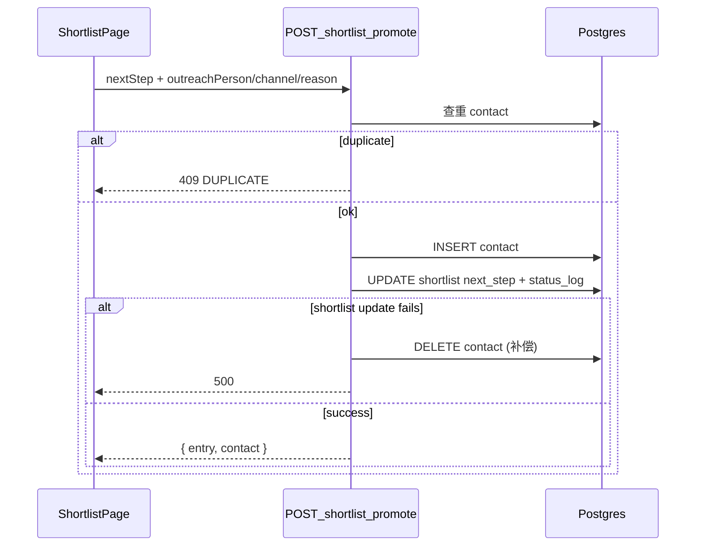

# 招聘推进链路修复说明

> 记录日期：2026-07-17  
> 范围：短名单加入 → 推进外联 → 联系人 CRUD  
> 关联模块：`shortlist`、`contacts`、`pipeline`

---

## 1. 问题背景

在 `VITE_USE_MOCK_API=false` + Supabase Auth 本地开发模式下，业务 API 走云端 Edge Function（见 [LOCAL_DEV_API_ROUTING.md](./LOCAL_DEV_API_ROUTING.md)）。原实现存在以下问题：

| 症状 | 根因 |
|------|------|
| 点击「推进」报 `Failed to promote entry` | Edge `addEntry` 用 `JSON.stringify` 写 `status_log`，`promoteEntry` 对字符串 `.push()` 抛错 |
| 报错后联系人名单仍有记录 | 前端先 `createContact` 再 `promoteShortlistEntry`，两步无事务 |
| 联系人无法编辑 | 旧版 Edge PATCH 将 `status` 写为 `"undefined"`，违反 `contacts_status_check` |
| 联系人去重失效 | 旧版 POST 无应用层查重；DB UNIQUE 约束可能未迁移 |

---

## 2. 修复后数据流



与「发送面试邀请」一致：**单请求、多表、后端负责原子性**。

---

## 3. API 契约

### `POST /api/shortlist/:id/promote`

**仅改阶段（向后兼容）：**

```json
{ "nextStep": "安排面试" }
```

响应：

```json
{ "entry": { /* ShortlistEntry */ } }
```

**发起外联（原子）：**

```json
{
  "nextStep": "发起外联",
  "outreachPerson": "张三",
  "channel": "wechat",
  "reason": "岗位匹配度高"
}
```

响应：

```json
{
  "entry": { /* ShortlistEntry */ },
  "contact": { /* Contact */ }
}
```

### 错误码

| HTTP | code | 场景 |
|------|------|------|
| 404 | NOT_FOUND | 短名单条目不存在 |
| 409 | DUPLICATE | 同候选人+岗位已有联系人 |
| 400 | VALIDATION_ERROR | 缺少 nextStep 或 outreach 字段不合法 |
| 500 | INTERNAL_ERROR | 推进失败（Edge 会补偿删除已插入的 contact） |

### 联系人 CRUD（`/api/contacts` → Edge `/contacts`）

| 方法 | 行为 |
|------|------|
| POST | 插入前 `(candidate_id, position_id)` 应用层查重；23505 → 409 |
| PATCH | 仅更新传入字段；校验 status / channel |
| DELETE | `DELETE /contacts/:id` |

### 已废弃

`POST /cross-table-ops/shortlist-promote` → **410 DEPRECATED**，请使用 `POST /api/shortlist/:id/promote`。

---

## 4. 实现要点

### status_log（Edge Function）

- 新建 [`supabase/functions/embox-api/_shared/shortlistStatusLog.ts`](../supabase/functions/embox-api/_shared/shortlistStatusLog.ts)
- **写入 JSONB 时使用 JS 数组**，禁止 `JSON.stringify([...])` 后再 insert
- `appendToLog()` 兼容 legacy 字符串格式

### Express 原子推进

[`server/src/modules/shortlist/shortlist.routes.ts`](../server/src/modules/shortlist/shortlist.routes.ts) 外联模式使用 `transaction()`：

1. SELECT 查重 contact  
2. INSERT contact  
3. UPDATE shortlist + status_log（SQL `|| jsonb`）

### Edge 补偿事务

PostgREST 无跨表事务：contact INSERT 成功后若 shortlist UPDATE 失败，DELETE 刚插入的 contact。

### 前端

[`ShortlistPage`](../src/modules/shortlist/pages/ShortlistPage.tsx) 仅调用一次 `promoteShortlistEntry(id, { nextStep, outreachPerson, channel, reason })`。

Mock 模式在 [`shortlist/api.ts`](../src/modules/shortlist/api.ts) 内同步写 `em-box.mock.contacts`。

---

## 5. 验证矩阵

| 环境 | 推进 | 联系人编辑 | 联系人删除 |
|------|------|-----------|-----------|
| Mock (`USE_MOCK_API=true`) | 本地 localStorage 原子 | contacts mock API | contacts mock API |
| Express (`localhost:4000`) | transaction | PATCH 多字段 | DELETE `/:id` |
| Edge（云端） | 补偿事务 + status_log 修复 | PATCH 多字段 | DELETE `/:id` |

### 推荐验证命令

```bash
# Edge status_log 单测（需 Deno）
deno test supabase/functions/embox-api/_shared/__tests__/shortlistStatusLog.test.ts

# Express 路由
cd server && npx vitest run src/__tests__/routes/shortlist.test.ts src/__tests__/routes/contacts.test.ts

# 前端
npx vitest run src/modules/shortlist/pages/ShortlistPage.test.tsx
npm run lint
```

---

## 6. 部署说明

**代码修复不依赖新的 DB migration**；应用层查重可在无 UNIQUE 约束时工作。

本地 `USE_MOCK_API=false` + Supabase Auth 时，请求仍走云端 Edge Function，需 **一次性部署**：

```bash
supabase functions deploy embox-api --project-ref eqdfyhqeqkbjvivscjau
```

可选：在 Supabase 执行 UNIQUE 约束迁移（双保险）：

- `server/src/db/migrations/039_add_shortlist_unique_constraint.sql`
- `server/src/db/migrations/040_add_contacts_unique_constraint.sql`
- 或 `supabase/migrations/20260717120000_add_shortlist_contacts_unique_constraints.sql`

---

## 7. 变更文件索引

| 文件 | 变更 |
|------|------|
| `supabase/functions/embox-api/_shared/shortlistStatusLog.ts` | 新增 status_log 工具 |
| `supabase/functions/embox-api/shortlist/index.ts` | status_log 修复 + 原子 promote |
| `supabase/functions/embox-api/contacts/index.ts` | POST 查重 |
| `supabase/functions/embox-api/cross-table-ops/index.ts` | shortlistPromote 废弃 |
| `server/src/modules/shortlist/shortlist.routes.ts` | 事务化 promote |
| `server/src/modules/contacts/contacts.routes.ts` | POST 查重 |
| `src/modules/shortlist/api.ts` | 统一 promote API + mock 原子 |
| `src/modules/shortlist/pages/ShortlistPage.tsx` | 单次 promote 调用 |
